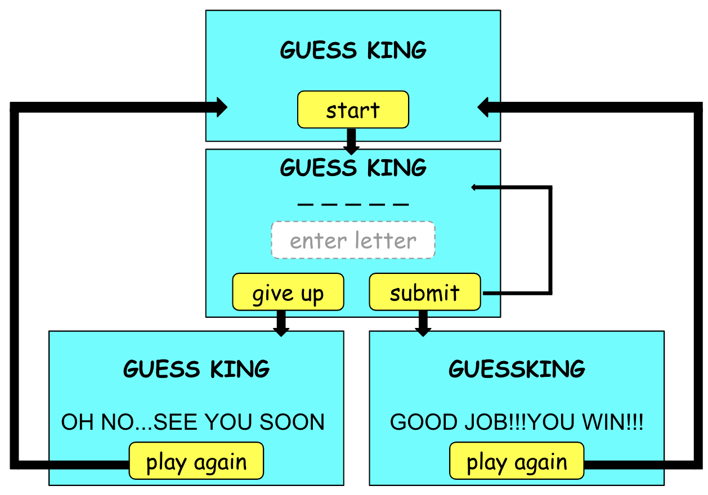
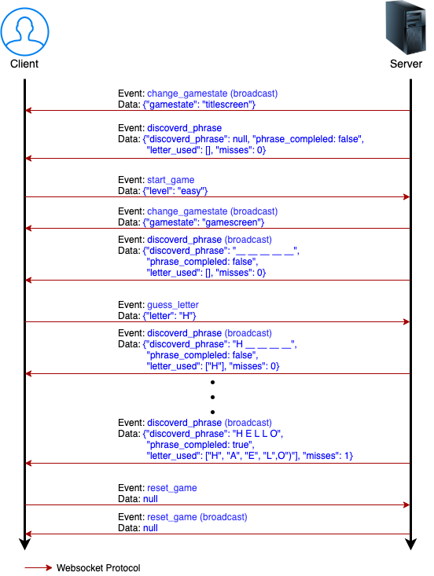

# Guess King (Hangman Web Game)

A hangman web game using Python3 and Javascript


## Quick Start

Run the docker container and access with port 5000

```bash
docker run --rm --name guess-king -d -p 5000:5000 e1ee1e11/guess-king
```

Browse http://127.0.0.1:5000/

## How to run

**Requirements**

``` bash
sudo apt update
sudo apt install python-pip virtualenv
```

**Step 1**: Setup environment (only first time)
```bash
cd guess-king/
virtualenv -p $(which python3) venv
source ./venv/bin/activate
pip install -r requirements.txt
deactivate
```

**Step 2**: Start the server (in guess-king folder)

```bash
source ./venv/bin/activate
python server.py
```

**Step 3**: Open the webpage

In a browser, go to:

```bash
http://127.0.0.1:5000
```

**Optional**: Start the server in debug mode

Run flask server in debug mode in order to print debug logs.

The phase will be set as "HELLO" in debug mode.

```bash
python server.py --debug
```

## Project files

These are the files you need to change when you want to make changes.

```
guess-king/              (project folder)
|
├── server.py            (Python server)
├── static/
|   └── js/
|       └── hangman.js   (Javascript loaded on website)
|   └── css/
|       └── hangman.css  (CSS loaded on website)
└── templates/
    └── index.html       (HTML loaded on website)
```


## Game flow



## Websocket flow

